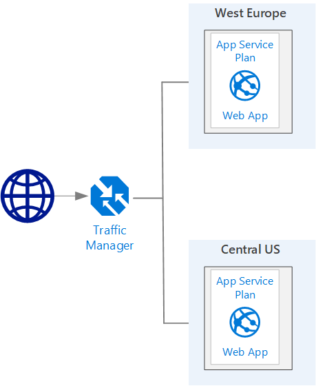

Deploy a Web App

This will deploy two Azure Web Apps. One in West Europe and one in Central US with a customized homepage to show in which region the Web App is running.

The only remaining tasks to make this NVA demonstration to work are:

* Create and configure a Traffic Manager profile
