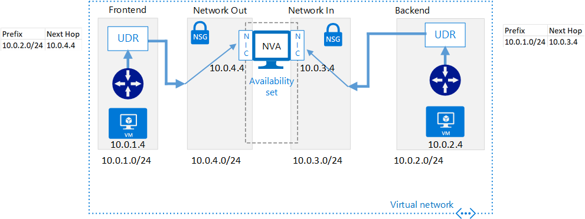

Deploy a VNET by specifying the Name, Addressrange and Subnets

The only remaining tasks to make this NVA demonstration to work are:

* Enable forwarding on both NICs of the router VM
* create the Route Tables for both the frontend and backend subnet.